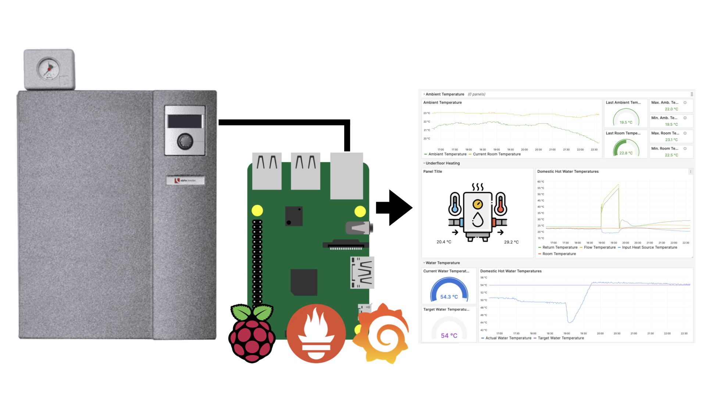

# Introduction

This Python based project allows you to monitor your [Alpha Innotec](https://www.alpha-innotec.nl/) (or any other heat pump that supports a Luxtronix control panel) and get information such as water and room temperatures, pump status etc. into a dashboard using [Prometheus](https://prometheus.io) and [Grafana](https://grafana.com/grafana/).



While the intention of this project is run this on a Raspberry Pi, any computer that can run Python will work.

This is still a work in progress. Not all metrics are fully supported and tested and this solution only reads data from the heat pump andis not able to control the heatpump's features.

## Setup & Configuration

This documentation assumes that you are already familiar with setting up [Prometheus](https://prometheus.io) and [Grafana](https://grafana.com/grafana/) and that you know how to scrape metrics and present data in dashbaords.

It is also recommended that you understand how to setup services in systemd if want thes tools to start automatically on your Raspberry Pi.

Edit the ```config.py``` file to configure the port you wish to export metrics on and the IP address of your heat pump.

```python
serverHost = "0.0.0.0"
serverPort = 8888

heatpumpHost = "192.168.2.77"
heatPumpPort = "8214"
```

Use the ```metrics``` dictionary to add new metrics that you'd like to add or adapt your configuration to your heat pump's language if you prefer Dutch, German etc.

Don't forget to install the required python dependencies. This project attempts to use as few dependencies as possible and should only require the [requests](https://pypi.org/project/requests/) and [websocket-client](https://pypi.org/project/websocket-client2/) packages to be installed via [pip](https://pypi.org).

Start the exporter by running ```main.py```.

## Metrics

Using ```curl http://localhost:8888``` you can verify which metrics are being read from your heat pump. Here's a sample below:

```
# HELP heat_pump_ambient_temperature The current ambient temperature in degrees celsius. Generally this is the outside temperature.
# TYPE heat_pump_ambient_temperature gauge
heat_pump_ambient_temperature 19.6
# HELP heat_pump_current_room_temperature The current room temperature in degrees celsius.
# TYPE heat_pump_current_room_temperature gauge
heat_pump_current_room_temperature 22.9
# HELP heat_pump_actual_service_water_temperature The actual service water temperature in degrees celsius. The current temperature of water supplying hot water taps. 
# TYPE heat_pump_actual_service_water_temperature gauge
heat_pump_actual_service_water_temperature 54.1
# HELP heat_pump_target_service_water_temperature The target service water temperature in degrees celsius.
# TYPE heat_pump_target_service_water_temperature gauge
heat_pump_target_service_water_temperature 54.0
# HELP heat_pump_flow_temperature The flow temperature in degrees celsius. The flow temperature refers to the temperature of the water in the supply (flow) pipe in a heating system or separate part of a heating system.
# TYPE heat_pump_flow_temperature gauge
heat_pump_flow_temperature 25.2
# HELP heat_pump_return_temperature The return temperature in degrees celsius. The return temperature is the temperature of the water in the pipe system after heat has been released into the building. The difference between inlet temperature and return temperature of the water occurs during transport through the heating system.
# TYPE heat_pump_return_temperature gauge
heat_pump_return_temperature 29.1
# HELP heat_pump_target_return_temperature The target return temperature in degrees celsius.
# TYPE heat_pump_target_return_temperature gauge
heat_pump_target_return_temperature 15.0
# HELP heat_pump_hot_gas_temperature The hot gas temperature in degrees celsius.
# TYPE heat_pump_hot_gas_temperature gauge
heat_pump_hot_gas_temperature 29.3
# HELP heat_pump_input_heat_source_temperature The input heat source temperature in degrees celsius.
# TYPE heat_pump_input_heat_source_temperature gauge
heat_pump_input_heat_source_temperature 20.5
# HELP heat_pump_intake_compressor_temperature The intake compressor temperature in degrees celsius.
# TYPE heat_pump_intake_compressor_temperature gauge
heat_pump_intake_compressor_temperature 39.2
# HELP heat_pump_intake_vapor_temperature The intake vapor temperature in degrees celsius.
# TYPE heat_pump_intake_vapor_temperature gauge
heat_pump_intake_vapor_temperature 18.3
# HELP heat_pump_2nd_heat_generator_1_status Second heat generator 1 status (e.g. electric heating element) in the storage tank (0=Off 1=On).
# TYPE heat_pump_2nd_heat_generator_1_status gauge
heat_pump_2nd_heat_generator_1_status 0
```

## Running the Heat-pump Exporter as a service

It is recommended that you configure the exporter as a systemd service. This [tutorial](https://medium.com/@benmorel/creating-a-linux-service-with-systemd-611b5c8b91d6) is good guide but if you've setup Prometheus or Grafana before you've done this before.

Here's an example of what a ```heat-pump-exporter.service``` file added to your Pi's ```/etc/systemd/system/``` directory can look like if you installed the heat pump telemetru exporter to ```/opt/heat-pump-telemetry-exporter```.

```
[Unit]
Description=Heat Pump Telemetry Exporter
Documentation=https://github.com/gerarddejong/heat-pump-telemetry-exporter
After=network-online.target

[Service]
User=pi
Restart=on-failure

ExecStart=python3 /opt/heat-pump-telemetry-exporter/main.py
WorkingDirectory=/opt/heat-pump-telemetry-exporter/

[Install]
WantedBy=multi-user.target
```

## Integration with Prometheus & Grafana

Once you've got metrics comming in via the exporter you'll need to update your ```prometheus.yml``` configuration to scrape data into the time series database. Here's an example of what to add under the ```scrape_configs:``` section: 

```
- job_name: heat-pump
  honor_timestamps: true
  scrape_interval: 60s
  scrape_timeout: 60s
  metrics_path: /metrics
  scheme: http
  follow_redirects: true
  enable_http2: true
  static_configs:
  - targets:
    - localhost:8888
```

Remember not to set the scrape interval to often. Other implementations can scrape data every 10 seconds or less this is has crashed the Luxtronic control panel 2x in my experience and appears more stable on an interval of 60 seconds.

You can import the provided ```Heat Pump-Grafana-Dashboard.json``` dashboard into Grafana version 10 or later.

## Adding Additional Metrics 

If you would like to add additional metrics, add them to the ```config.py``` file's ```metrics``` dictionary and be sure to use the exact same names used in the Web UI's WebSocket implementation. The dictionary holds the title of each menu section as the key to each metric's group and the a specific metric can be chosen to be made availble for export to Prometheus. ```name``` is the name is the metric is called in the ebSocket implementation the ```variable``` key can be used to change what the metric is called when imported to Prometheus.

```json
"Temperatures" : [
        {
            "name": "Amb. temp.",
            "help": "The current ambient temperature in degrees celsius. Generally this is the outside temperature.",
            "type": "gauge",
            "variable" : "heat_pump_ambient_temperature"
        }
]
```

Note that f you wish to add your own metrics and they use unknown units that such data will require some conversion and parsing to prevent errors.

## Localisation & Language Support

If you are running your heat pump contol panned in a differnt language, expect to need to update the ```config.py``` file with the correct translation for your language. If you do any translations please consider submitting them as an update to this project via a pull request. Something like ```config_de.py``` or ```config_nl.py``` will be appreciated.

## Security Considerations

It is recommended that you never make your heat pump direclty accessible to the internet. One method would be put a Raspberry Pi in between the heat pump and the rest of your network in order to isolate it by connecting the heat pump to the ethernet jack of the Pi and then connecting the Pi to you Wifi via the Pi's built in Wifi or an USB dongle.

This can be further secured with a firewall such as [UFW](https://en.wikipedia.org/wiki/Uncomplicated_Firewall#:~:text=Uncomplicated%20Firewall%20(UFW)%20is%20a,to%20be%20easy%20to%20use.) and serving metrics via https.